# 《TurnBase2》游戏设计文档

## 0. 文档说明

### 0.1 文档目的

本文档用于描述《TurnBase2》希望为玩家提供的游戏体验、玩法规则、系统关系、内容构成与后续制作方向。它面向策划、程序、测试，不以代码结构或类职责为中心。

### 0.2 最重要的设计结论

《TurnBase2》的核心不是传统意义上彼此割裂的“开放世界模式”和“菜单回合制模式”，而是以下连续体验：

> 玩家以高机动角色探索立体场景，通过跑动、冲刺、跳跃、攀爬、翻越和抓钩接近目标，在场景中主动发起攻击或被敌人截获，随后进入强调行动顺序、元素弱点、主动防御、QTE 与队伍配装的回合战斗，胜利后带着角色状态、符文熟练度和世界进度回到探索。

### 0.3 一页设计总览

下图用于让第一次阅读文档的人在一分钟内理解各模块如何共同服务同一段玩家体验；箭头表示玩家进程与系统反馈，而不是程序调用关系。

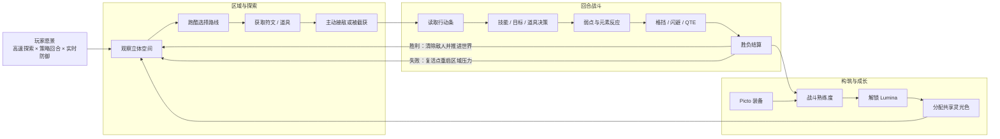

| 阅读层级 | 先看什么             | 解决的问题            |
| ---- | ---------------- | ---------------- |
| 总览   | 本图、核心循环、整体流程     | 这款游戏是什么，玩家反复做什么？ |
| 模块   | 探索、遭遇、战斗、元素、主动防御 | 每个模块怎样形成决策与反馈？   |
| 内容生产 | 符文、Boss 模板       | 策划怎样持续制作可组合内容？   |

---

## 1. 游戏概述

### 1.1 介绍

一款将第三人称高机动探索与队伍行动条回合战斗结合的风格化角色扮演游戏；玩家既要在场景中熟练移动并争取遭遇主动权，也要在战斗中规划队伍行动、利用元素弱点，并通过实时格挡、闪避和 QTE 影响回合结果。

### 1.2 品类定位

| 维度   | 当前定位                        |
| ---- | --------------------------- |
| 核心品类 | 第三人称探索 + 队伍制回合 RPG          |
| 战斗结构 | 基于速度与行动值的动态行动条回合制           |
| 操作特点 | 探索实时操作；回合战斗与实时防御/QTE 混合     |
| 队伍规模 | 支持最多 4 名玩家角色                |
| 角色养成 | 角色属性、技能、终结技、符文、灵光色          |
| 敌人结构 | 基础敌人小队、Boss + 可选随从、多阶段 Boss |
| 视角   | 第三人称跟随视角；战斗使用情境化镜头和演出镜头     |
| 联机基础 | 已有服务端权威与状态同步基础；提供联网服务       |
| 美术倾向 | 当前 Demo 为风格化二次元/卡通渲染倾向；     |

### 1.3 目标玩家

当前玩法更适合以下玩家：

- 喜欢具有高机动性和立体路径选择的第三人称探索玩家。
- 喜欢角色养成、配队、局内策略和资源循环的回合制玩家。
- 希望回合战斗仍保留操作参与感，而非只进行菜单选择的玩家。
- 喜欢通过装备组合、被动触发和 Boss 机制构筑战术的玩家。
- 能接受角色动画、技能演出和镜头表现占据较高体验权重的玩家。

---

## 2. 体验愿景与设计支柱

### 2.1 体验愿景

玩家应当感受到两个节奏相反但相互支撑的层次：

- 探索时是自由、连续、轻快的。移动本身应该有乐趣，场景高度和路线具有意义。
- 战斗时是清晰、可预测但允许临场反应的。玩家既规划未来若干次行动，也会在敌人出手时通过操作改变结果。

模式切换不应让玩家感觉“进入了另一个无关游戏”。探索中的队伍、遭遇对象、先手关系、角色状态和获取的构筑资源都应在战斗中继续发挥作用；战斗结果则应持续改变探索世界和长期成长。

### 2.2 四个核心设计支柱

#### 支柱 A：移动跑酷就是玩法

跑、冲刺、跳跃、空中动作、攀爬、翻越、下落和抓钩不是单纯的赶路功能，而是探索路线、资源获取、敌人接近方式和场景节奏的基础。

#### 支柱 B：遭遇前后是一条连续链路

玩家在探索场景中攻击敌人、远程命中敌人、被敌人发现或进入 Boss 触发范围，都能自然进入战斗。转场表现应强化冲突升级，而不是掩盖两个系统之间的断裂。

#### 支柱 C：回合规划中保留实时参与

行动条允许玩家预测未来，技能延迟和速度允许玩家改变未来；敌方回合中的格挡、完美格挡、闪避和 QTE 则要求玩家保持注意力。战斗应同时奖励规划能力与操作反应。

#### 支柱 D：构筑改变规则，而不只增加数值

符文不仅提供属性，还能在战斗开始、回合开始、命中、暴击、击杀、闪避、格挡、死亡等事件上触发效果。玩家通过熟练度、Lumina 和 Aura 逐步把单件装备转化为可组合的长期战斗规则。

四个支柱之间必须形成闭环，而不是各自成为孤立卖点：

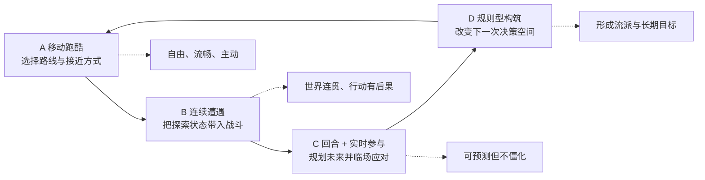

### 2.3 设计反目标

后续开发应避免以下方向：

- 探索只有空旷赶路，移动能力没有路线或奖励上的用途。
- 遭遇转场很华丽，但探索中的先手、敌人类型和位置对战斗没有影响。
- 行动条只是装饰，速度和技能延迟无法形成可感知的策略。
- 主动防御没有明确提示或收益。
- 符文大多只提供百分比攻击和生命，无法形成战术流派。
- Boss 只有血量和伤害提升，没有阶段、部位、技能禁用和行为变化。
- 为了兼容旧逻辑，让同一条游戏规则在蓝图与 C++ 中并行运行并产生不同结果。

---

## 3. 核心循环

### 3.1 长期循环

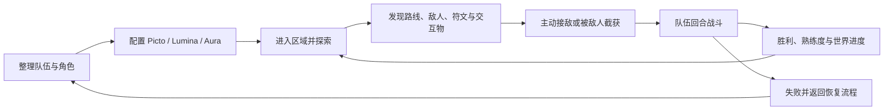

### 3.2 区域内短循环

1. 观察环境高度、攀爬面、抓钩点、敌人巡逻和可拾取物。
2. 选择安全路线、快速路线或主动战斗路线。
3. 使用移动能力穿越场景并管理耐力。
4. 拾取符文或触发世界交互，长期保存符文档案。
5. 使用近战、远程或接近方式发起遭遇，或被敌人检测后进入战斗。
6. 在战斗中消耗技能点、道具和能量，并通过元素与主动防御降低风险。
7. 胜利后返回原位置附近，清除对应探索敌人，继续探索。

### 3.3 战斗内循环

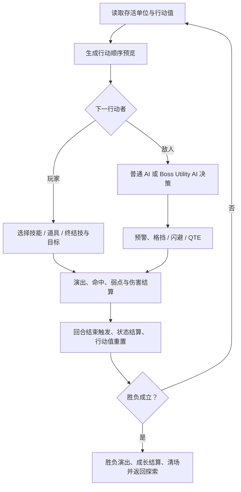

### 3.4 三层循环的时间尺度

同一套系统在不同时间尺度上给玩家不同问题，避免把“长期养成”与“当前回合选择”混为一谈。

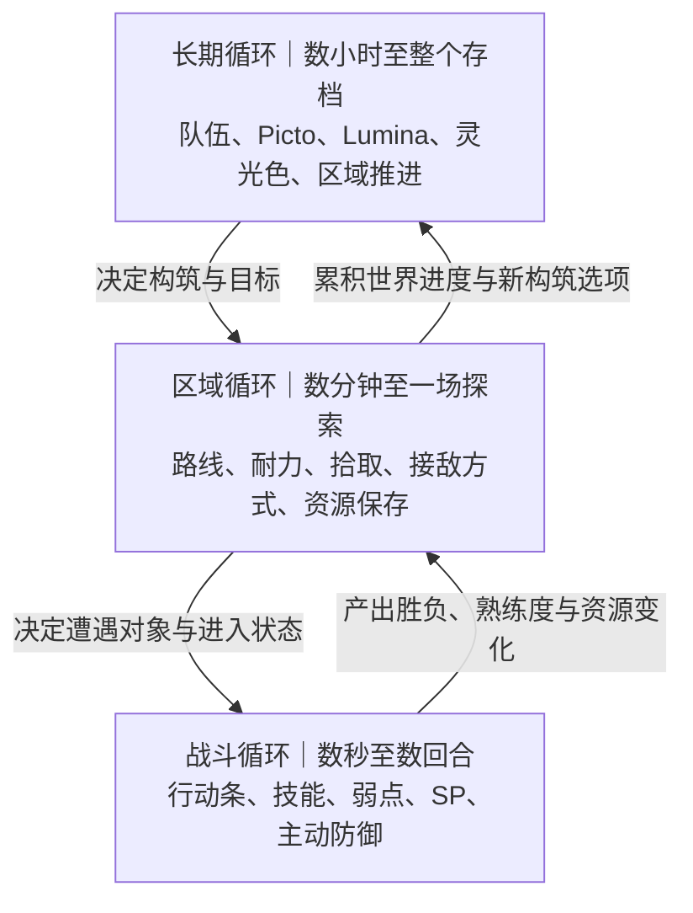

---

## 4. 整体游戏流程

### 4.1 队伍准备

探索角色蓝图中已经存在完整的队伍选择界面流程，包括队伍信息读取、角色展示、单位面板、选择槽刷新、成员替换和第一个有效成员选取。战斗 HUD 支持 4 个角色槽，因此当前策划基线为：

- 战斗队伍最多 4 名角色。
- 每个队伍位置绑定一名已解锁角色。
- 玩家在探索时控制队伍中的一名代表角色。
- 切换探索角色时，外观、动画、武器、探索攻击形式和相关能力随角色数据更新。
- 允许空槽，但不允许重复角色以及战斗中换人。

### 4.2 进入区域

正式区域应至少提供：

- 起点或安全区。
- 多层移动路线。
- 普通敌人巡逻区。
- 可选精英或高风险路线。
- 符文/道具拾取点。
- 抓钩点、攀爬面和翻越障碍。
- Boss 区域和进场演出触发点。
- 存档、恢复或传送设施。

### 4.3 战斗结束后的世界反馈

- 玩家胜利：对应探索敌人被移除，队伍重新获得探索控制，胜利角色与倒下角色都可记录本场符文熟练度。
- 玩家失败：返回上一次的复活点，恢复敌人，损失临时资源。

### 4.4 一次完整游玩流程状态图

该图强调“探索—战斗—世界反馈”是一个可回到世界的闭环，失败也会产生明确的重启位置和代价。

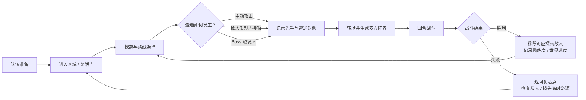

---

## 5. 探索模块设计

### 5.1 探索角色目标

探索操作应达到以下体验目标：

- 输入后角色快速响应，但动作仍有明确重量与起止节奏。
- 步行、跑步和疾跑有可辨识的速度与动画差异。
- 突然停步、急转和 180 度转身具有自然的惯性表现。
- 地面、空中、攀爬和翻越之间能够连续衔接。
- 玩家能通过画面、角色姿态和 UI 明确知道当前可执行或被禁止的动作。

### 5.2 基础移动

| 功能    | 游戏规则                        |
| ----- | --------------------------- |
| 移动    | 以相机和角色当前旋转模式为依据进行第三人称移动。    |
| 步态    | 支持步行、跑步、疾跑三个主要速度层级。         |
| 旋转    | 支持移动方向与观察/相机方向两类旋转意图。       |
| 停步    | 根据步态、方向与脚步相位选择不同停步动作，保留惯性感。 |
| Pivot | 高速反向输入时进入急转动作，并在完成后恢复移动。    |
| 空中状态  | 跳跃、下落、落地和空中攻击拥有独立状态与转场。     |
| 其它状态  | 攀爬、翻越等额外状态；                 |

#### 探索移动状态关系

这张状态图用于检查动作衔接与输入冲突；它表达策划允许的转换，不代表动画状态机必须一比一照搬。

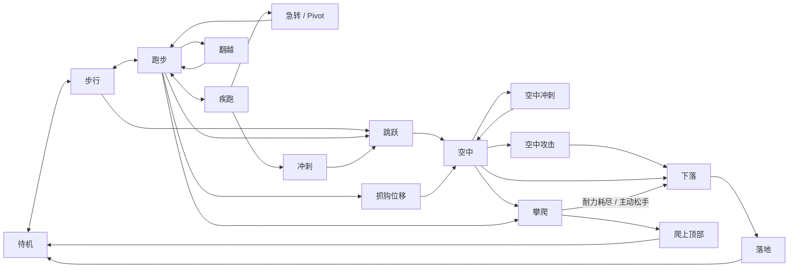

### 5.3 疾跑与冲刺

- 疾跑属于持续步态，冲刺属于短时动作能力，两者应在手感和资源逻辑上区分。
- 冲刺根据地面/空中和输入方向选择动作表现。
- 冲刺期间可限制其他能力；空中攻击激活期间会阻止冲刺。
- 冲刺结束应平滑衔接跑动、疾跑、跳跃或停步，不应出现速度骤停。
- 冲刺消耗耐力、存在有无敌帧，一旦检测到期间受到敌人攻击马上转到闪避动画。
- 冲刺具备两个空中变种，一共四种动画。

### 5.4 跳跃与落地

- 跳跃会依据当前移动速度选择对应动作。
- 原地跳与前向跑跳使用混合表现，位移由统一规则驱动。
- 可从冲刺衔接跳跃。
- 落地后清理多余水平速度，避免角色持续滑动。
- 动画结束和实际落地均可作为动作结束条件，但最终必须以角色真实运动状态为准。

### 5.5 攀爬与翻越

探索角色可检测墙面并进入攀爬。攀爬系统支持：

- 自动贴墙与手动开始攀爬。
- 上、下、左、右及四个斜向，共八方向移动。
- 普通攀爬与加速攀爬。
- 起爬、爬上顶部、翻越障碍、向下攀附和直接落下。
- 攀爬跳跃、跳离墙面和转角吸附。
- 左右手 IK，使手掌更贴近墙面目标。
- A/B 交替攀爬相位，保证连续动作节奏。

攀爬消耗耐力：静止攀附与移动攀爬可以使用不同的每秒消耗，开始攀爬还需要达到最低耐力门槛。耐力耗尽后的结果：强制下落。

### 5.6 抓钩

- 场景中存在可用抓钩锚点。
- 系统根据准星方向、距离、屏幕位置和视线从候选点中选出最佳目标。
- 锚点需要向玩家提供可用、锁定和不可用三种视觉状态。
- 服务端再次验证距离与视线，防止抓取无效或被遮挡目标。
- 抓钩通过独立动作能力执行，可使用专属动画槽和表现。
- 锚点不可移动、不可破坏。

### 5.7 探索攻击

| 攻击类型 | 规则                                     |
| ---- | -------------------------------------- |
| 近战   | 使用攻击连段和动画窗口；武器刀身按根部、尖端与采样密度进行轨迹检测。     |
| 连击   | 在连击窗口内缓存输入，窗口开启时允许衔接下一段，执行通知决定真正进入下一段。 |
| 空中攻击 | 在空中播放独立攻击动作，可产生下压或发射/位移表现，并暂时阻止冲刺。     |
| 远程   | 远程型探索角色从配置的发射点生成投射物，命中探索敌人后可触发战斗。      |
| 武器状态 | 手持武器与收纳武器分别控制显示，拔出、待机和收刀由动作通知切换。       |

探索攻击当前最重要的功能是建立遭遇，而非在探索场景中完成完整的实时战斗。是否允许玩家在进战前直接削减敌人生命、造成眩晕或获取先手，需要策划正式定义。

### 5.8 探索敌人行为

- 普通敌人可在场景中巡逻。
- 检测范围内发现玩家后可追击，并通过移动行为接近目标。
- 敌人可配置对应的战斗敌方小队。
- 敌人与玩家接触或满足攻击条件时可主动触发战斗。
- Boss 探索单位可配置进入范围即开战，并可携带随从阵容。

### 5.9 区域路线结构示意

下图是关卡阅读模板，不代表实际地图。正式区域应让移动能力、风险、奖励和遭遇选择在空间上发生关系。

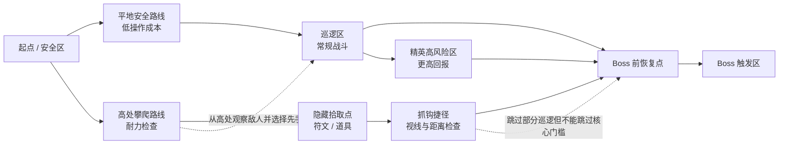

| 路线    | 主要考验     | 主要回报      | 应避免的问题      |
| ----- | -------- | --------- | ----------- |
| 安全路线  | 基础移动与观察  | 稳定推进      | 只有无意义的长距离赶路 |
| 快速路线  | 冲刺、跳跃、抓钩 | 节省时间或取得先手 | 捷径完全取代其他路线  |
| 战斗路线  | 接敌与资源管理  | 熟练度、常规掉落  | 遭遇没有空间准备价值  |
| 高风险路线 | 攀爬耐力、精英战 | 稀有符文或重要资源 | 风险与奖励不匹配    |

---

## 6. 遭遇与模式切换

### 6.1 遭遇来源

战斗可由以下事件触发：

1. 玩家近战攻击命中探索敌人。
2. 玩家远程投射物命中探索敌人。
3. 敌人检测、追击或碰撞到玩家。
4. 玩家进入 Boss 遭遇触发范围。

### 6.2 转场流程

1. 确认玩家当前未在战斗、未处于不可切换状态，且目标有效。
2. 冻结重复进战请求并记录遭遇敌人。
3. 移除或隐藏探索 HUD。
4. 播放碎屏/裂屏转场表现。
5. 构建玩家队伍和该探索敌人对应的敌方队伍。
6. 生成战斗角色、战斗输入代理、战斗 HUD、行动条、QTE 组件和战斗镜头。
7. 进入战斗初始化与首个行动者计算。

#### 遭遇转场时序图

时序图把玩家看到的表现与必须完成的状态交接放在同一条时间线上，便于策划、程序和测试共同核对。

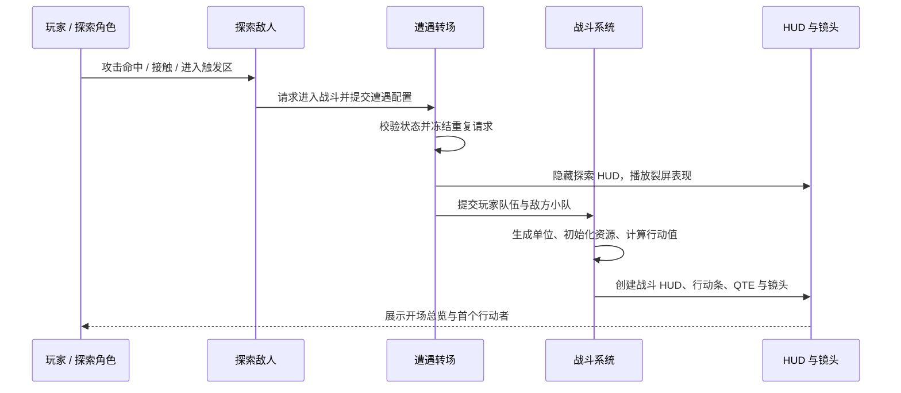

### 6.3 返回探索

战斗结束后恢复原探索角色控制、相机、移动模式和 HUD；销毁临时战斗单位。胜利时移除对应探索敌人，失败时保留并恢复敌人。

需重点保证：探索生命/战斗生命如何继承、死亡角色回到探索后的状态、战斗中消耗道具是否立即存档，以及 Boss 胜利后世界状态如何改变。

---

## 7. 战斗模块设计

### 7.1 战斗目标

战斗应让玩家持续回答三个问题：

1. **现在做什么最有效？**——技能、目标、道具还是终结技。
2. **这样做会怎样改变未来？**——技能消耗、行动延迟、能量、状态和行动条位置。
3. **敌人出手时我能否改变结果？**——格挡、完美格挡、闪避和 QTE。

### 7.2 战斗阵容

- 玩家队伍由探索阶段当前队伍生成，UI 支持最多 4 名角色。
- 敌方阵容由场景中的探索敌人配置，可为一个或多个普通敌人。
- Boss 遭遇可生成 Boss 与随从。
- 每个战斗单位拥有独立生命、速度、技能点、能量、弱点、状态和行动值。
- 单位倒下后从正常行动队列移出，但仍保留在死亡数组中供复活和战后结算使用。

### 7.3 行动值与行动顺序

每个单位维护行动值。行动值越小，越早行动。当前重置公式为：

`下一次行动值 = 基础行动距离 × 技能行动延迟倍率 ÷ 速度`

当前基础行动距离为 10000。结算时所有单位减去最小行动值，使下一名行动者归零并开始回合。

由此得到以下规则：

- 速度越高，角色越频繁行动。
- `ActionDelayRate < 1` 的轻型技能会让角色更快再次行动。
- `ActionDelayRate > 1` 的重型技能会推迟角色下一次行动。
- 战斗中速度改变会按比例修正剩余行动值，不会简单重新洗牌。
- 额外立即回合进入独立插队队列，优先于普通行动值。
- 当前 UI 默认预览未来 8 个行动位置。

#### 行动条因果关系

行动条不是简单的固定轮流：速度决定基础频率，技能重量改变下一次行动距离，立即回合则短暂插队。

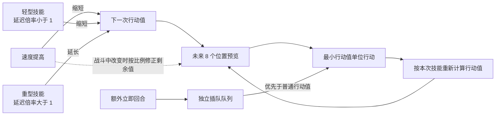

### 7.4 玩家回合

玩家角色行动时可选择：

- 使用角色技能。
- 使用战斗道具。
- 选择并确认目标。
- 当终结技能量满足条件时，进入或执行终结技。

技能目标类型包括：自身、单个敌人、全部敌人、单个队友、全部队友。复活技能允许把倒下单位作为合法目标。客户端选择只提供意图，最终目标会按照阵营、存活状态、技能类型和当前回合重新验证。

### 7.5 技能点（SP）

- 战斗单位默认初始技能点为 3。
- 每个技能可配置消耗。
- 释放前必须验证技能点足够，成功后消耗。
- 恢复 SP 道具默认恢复 3 点，当前上限按 10 点处理。
- SP 是每名角色独立。
- 普通攻击恢复 SP3点。
- 战斗开始始终重置为 3。
- 最大 SP 是否统一为 10 。

### 7.6 终结技

- 角色通过战斗行为积累能量。
- 普通技能默认基础能量获取值为 20；发生暴击时，本次能量获取提升至 1.3 倍。
- 终结技可进入独立队列，在正常回合结算间隙插入执行。
- 终结技可为单体、群体、自身或友方目标，并支持复活型标记。
- 终结技通过专属定序器演出；真正伤害与事件仍按服务器时间轴帧触发。
- 即时型和投射物型终结技均已有基础。

### 7.7 普通敌人回合

普通敌人会从满足技能点消耗的技能中，根据技能权重选择行动，并生成目标类型。眩晕状态可使敌人跳过或改变行动，恢复回合数可配置。

普通敌人的最低策划配置应包括：

- 至少一个常规低消耗技能。
- 至少一个具有清晰威胁的高价值技能。
- 目标偏好或权重差异。
- 弱点与韧性/眩晕反馈。
- 受击、死亡、闪避、格挡响应动作。

### 7.8 战斗道具

| 道具      | 当前规则                         | 初始数量 |
| ------- | ---------------------------- | ---- |
| 治疗道具    | 对合法存活目标恢复其最大生命的 50%。         | 3    |
| 复活道具    | 复活一名倒下角色，恢复其最大生命的 30%。       | 3    |
| SP 恢复道具 | 为存活目标恢复 3 SP，当前按最多 10 SP 限制。 | 3    |

* 使用道具前会检查库存并消耗 1 个。
* 道具库存会保存，并通过战斗 UI 同步显示。
* 道具动作结束后交接回合，因此当前应视为会消耗角色本次行动。

#### 战斗资源流

该图把“玩家为什么使用某种行动”与“它怎样影响后续回合”放在一起；方框是资源或状态，带标签的连线是获取与消耗。

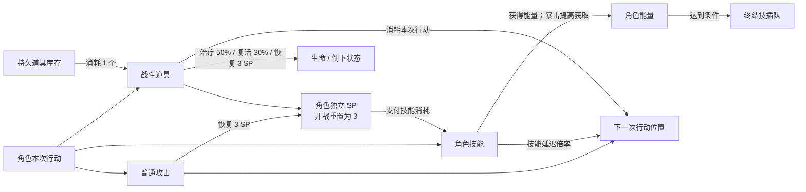

### 7.9 战斗镜头

战斗支持以下情境镜头：

* 战斗开场总览。（从最左边敌人开始往右预览敌人队伍）
* 玩家回合。（镜头平滑过渡到玩家摄像机，此摄像机位于玩家右肩后斜下方，正好最左边是玩家，右边大部分是敌人角色）
* 玩家增益/选择。（镜头位于玩家角色正前方对准玩家，换角色后平滑移动向指定角色）
* 敌人观察。（镜头位于玩家角色全体的后上方，总览战场局势）
* 敌方单体攻击。（镜头位于玩家角色全体的后上方，总览战场局势）
* 敌方群体攻击。（镜头位于玩家角色全体的后上方，总览战场局势）
* Boss 总览。（镜头位于玩家角色全体的后上方，总览战场局势）
* Boss 单体攻击。（镜头和玩家回合一致，专注当前角色和敌人的对峙）
* Boss 群体攻击。（镜头位于玩家角色全体的后上方，总览战场局势）

终结技、完美格挡反击和 Boss 阶段使用定序器镜头。镜头只负责表现，不改变目标与伤害规则。

#### 镜头空间线框与信息目的

以下为构图草图，不代表最终美术画面。`P` 为玩家队伍，`E` 为敌方，`C` 为摄像机，箭头表示观看方向。

| 情境                | 空间线框                              | 玩家此时必须看清            |
| ----------------- | --------------------------------- | ------------------- |
| 开场 / 敌人预览         | `C → E1　E2　E3　Boss`               | 敌人数量、体型、弱点提示与威胁层级   |
| 玩家回合 / 单体对峙       | `P　C ↗　　　　 E（目标）`                 | 当前行动者、目标、双方距离与攻击方向  |
| 友方增益 / 选人         | `C → P1　P2　P3　P4`                 | 角色状态、倒下情况、当前选择焦点    |
| 敌方群攻 / Boss 总览    | `C（后上方） ↘　P1 P2 P3 P4　｜　E / Boss` | 群体攻击范围、全队受威胁情况、战场关系 |
| 终结技 / 完美反击 / 阶段切换 | `定序器镜头 → 命中帧 → 结算后回标准机位`          | 演出重点与结算时点，结束后不迷失方向  |

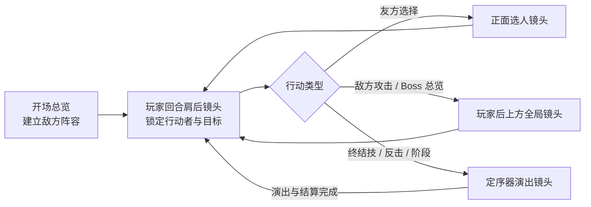

### 7.10 技能执行形态

| 形态    | 表现与结算                          |
| ----- | ------------------------------ |
| 近战    | 施法者移动至目标附近，播放攻击动作，在命中点结算后返回原位。 |
| 投射物   | 生成追踪或定向投射物，命中或超时后结束。           |
| 多投射物  | 对多个目标或同一目标连续生成投射物。             |
| 远程范围  | 在目标位置或多个目标上触发表现并结算。            |
| 蒙太奇事件 | 通过命中、间隔开始/结束和能力结束事件控制多段技能。     |
| 定序器技能 | 由帧事件控制伤害和阶段，适用于终结技和 Boss 大招。   |

### 7.11 胜负条件

- 所有敌方战斗单位死亡：玩家胜利。
- 所有玩家战斗单位死亡：敌方胜利。
- 战斗结束后取消仍在运行的技能、QTE、临时效果和镜头，播放胜负提示与淡出。
- 玩家胜利时记录参与角色的符文熟练度，随后销毁探索敌人。
- 玩家失败时保留探索敌人并返回复活点。

---

## 8. 伤害、属性与弱点

### 8.1 战斗属性

| 属性                         | 设计作用                   |
| -------------------------- | ---------------------- |
| Health / MaxHealth         | 当前生命与生命上限；归零时死亡。       |
| Stamina / MaxStamina       | 探索攀爬等持续动作资源。           |
| Attack                     | 物理/攻击倍率技能的主要来源。        |
| SpellPower                 | 法术/魔力倍率技能的主要来源。        |
| Speed                      | 决定行动值恢复速度和行动频率。        |
| Energy / MaxEnergy         | 终结技资源。                 |
| DamageRatio                | 全局伤害倍率。                |
| Shield                     | 当前公式中作为每次命中的固定减伤值。     |
| CriticalHitRate            | 暴击概率。                  |
| CriticalHitDamage          | 暴击伤害倍率。                |
| DodgeValue                 | 伤害结算时的随机闪避概率。          |
| Resistance                 | 百分比伤害减免，计算时最高按 95% 处理。 |
| BleedGauge / MaxBleedGauge | 出血累计槽；满槽时触发爆发。         |

### 8.2 当前伤害公式

**Demo 已实现，数值仍属原型基线**

`原始伤害 = 基础伤害 + 攻击 × 攻击倍率 + 法术强度 × 法术倍率`

`最终伤害 = 原始伤害 × 暴击倍率 × 全局伤害倍率 × 技能/符文倍率 × (1 - 抗性) - 护盾`

最终结果向下限制为不小于 0，并四舍五入为整数。

结算顺序：

1. 先进行随机闪避判定；成功则本次伤害及后续命中状态不再应用。
2. 进行暴击判定。
3. 计算攻击、法术、倍率、抗性和护盾。
4. 应用最终伤害并触发命中、暴击、击杀、受伤、死亡类符文事件。
5. 播放伤害数字、受击、暴击等表现。

#### 单次伤害结算管线

下图用于明确“规则结算”先后关系；主动格挡、手动闪避和 QTE 属于敌方技能流程，本图开头的闪避特指 `DodgeValue` 随机判定。

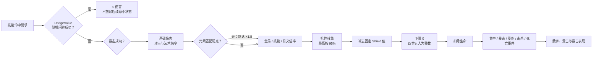

**重要待确认项**

当前 Shield 是“每次命中直接减去固定值”，并不会在此公式中随吸收伤害而扣除。若策划希望护盾是可耗尽的临时生命，需修改正式规则和实现。

### 8.3 弱点系统

- 每个角色、敌人和 Boss 部位可配置一个或多个元素弱点。
- 技能可拥有一个或多个元素。
- 技能元素与目标弱点匹配时，默认伤害倍率为 1.8。
- 弱点命中可在真正技能演出前显示专属弱点击破图片，当前默认展示 1.5 秒。
- 玩家角色和 Boss 可分别配置两张弱点命中演出图片。

### 8.4 出血槽

- 技能或效果可累计目标的出血槽。
- 出血槽达到上限时清零。
- 触发一次相当于目标最大生命 15% 的出血爆发事件。
- 出血爆发不暴击、不受抗性影响。

---

## 9. 元素与状态反应

### 9.1 元素列表

当前已定义：物理、火、冰、电、风、水、油、毒、虚数，以及无元素。

### 9.2 当前原型规则

| 元素/组合 | 当前规则                                                 |
| ----- | ---------------------------------------------------- |
| 火     | 施加持续燃烧；初次获得 6 点持续计数，每次自身回合结算后减少 3。                   |
| 重复火   | 为燃烧增加 6 点持续计数，延长效果。                                  |
| 毒     | 初次获得 5 点持续计数，每次自身回合结算后减少 2。                          |
| 重复毒   | 增加 3 点持续计数。                                          |
| 油     | 无火时施加 3 层油状态。                                        |
| 火 + 油 | 移除油并触发爆发效果。                                          |
| 水 + 火 | 移除火并播放蒸发表现，随后施加 3 层水。                                |
| 电 + 水 | 消耗水并必定施加眩晕/控制效果。                                     |
| 电（无水） | 30% 概率施加眩晕/控制效果。                                     |
| 风 + 火 | 刷新当前目标燃烧，并向 500 单位范围内其他存活敌人传播配置的状态。                  |
| 冰     | 已有元素、标签和表现入口，减慢敌人15%的速度，持续2回合。                       |
| 虚数    | 已有元素、标签和表现入口，是所有角色的弱点。                               |
| 物理    | 作为基础伤害属性存在，每次攻击使目标累计出血槽，积满触发一次相当于目标最大生命 15% 的出血爆发事件。 |

#### 元素反应关系图

实线表示已经定义的直接反应，虚线表示单一元素的独立规则。图中没有连线的组合目前不应由内容人员自行推断。

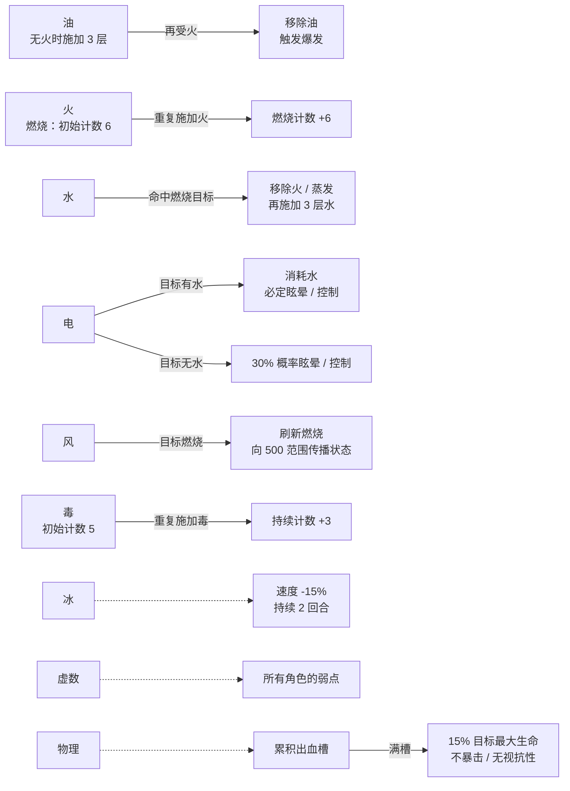

### 9.3 火与毒的当前伤害基线

当前每次结算均按目标最大生命百分比造成伤害：

- 火：`3% 最大生命 + 0.5% × 当前持续计数`。
- 毒：`1.5% 最大生命 + 1.2% × 当前持续计数`。

---

## 10. 主动防御与 QTE

### 10.1 设计目标

敌方回合不能成为玩家只能观看的时间。敌人的动作前摇、镜头和提示应向玩家提供可学习的时机，玩家通过主动防御减少伤害或反转局势。

### 10.2 格挡

- 仅在敌方行动阶段、且角色是攻击目标时有效。
- 普通格挡提供独立的视觉、音效和时间反馈。
- 完美格挡在更严格的时间窗中成立。
- 完美格挡可以触发专属反击技能和定序器演出。
- 群体攻击可使用统一的群体防御结果，避免同一次攻击重复结算冲突。

### 10.3 闪避

战斗中存在两种闪避概念：

1. 玩家主动按键触发的手动闪避，包含动作和位移表现。
2. 伤害GE依据 DodgeValue 进行的随机闪避。

### 10.4 完美格挡反击

- 每名玩家角色可拥有独立的完美格挡反击定义。
- 反击可移动到目标、播放定序器、在指定帧触发伤害，再返回原位。
- 反击期间正常回合推进会被暂时延后，避免演出与下一行动重叠。
- 完美格挡可触发符文效果。

### 10.5 QTE

- QTE 由敌人动作或动画事件发起。
- 一次 QTE 可以包含多个阶段，每段拥有持续时间和 Perfect 阈值。
- 玩家在提示阶段按下指定操作，系统判断成功、Perfect 或失败。
- 当前默认 Perfect 阈值为阶段进度的 0.75。
- QTE 期间可使用本地慢动作、阶段动画和结果停留。
- 完成后应用配置的战斗效果。

### 10.6 敌方攻击的玩家应对树

主动防御的价值来自“看懂提示并选择正确应对”，而不是在所有敌方攻击中重复按同一个键。随机闪避由伤害结算独立处理，不属于本图的玩家输入分支。

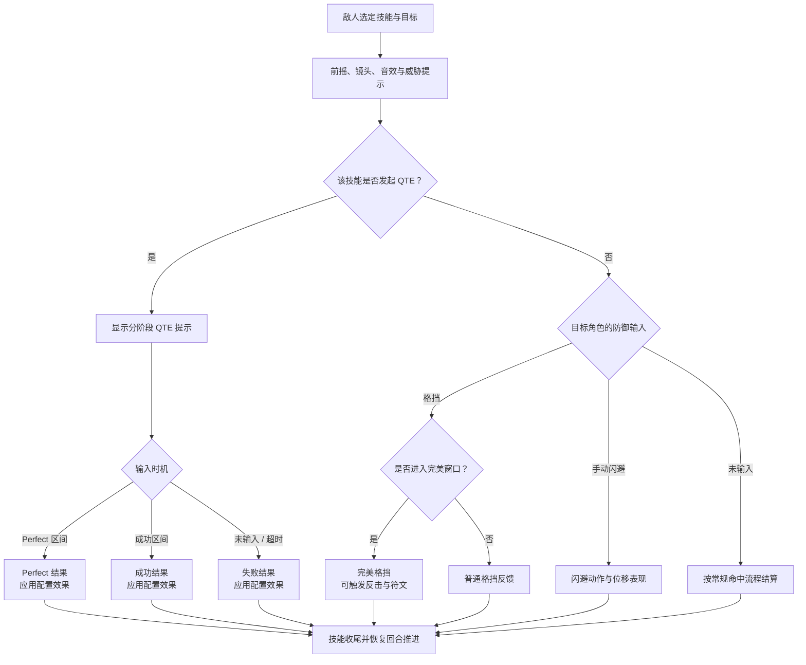

---

## 11. 符文、熟练度、灵光色

### 11.1 系统定位

符文系统是当前最明确的长期构筑系统。它通过“拾取—装备—参战—熟练—激活”的过程，把一件角色装备逐步转化为可自由组合的被动能力。

### 11.2 获取与拥有

- 场景中可放置符文拾取物。
- 拾取后按 RuneID 加入全局符文库存。
- 符文库存、熟练度、Lumina 学习状态和角色配置均可保存。

### 11.3 Picto 装备

- 每名角色固定拥有 3 个 Picto 装备槽。
- 同一枚符文同一时间只能由一名角色装备。
- 装备中的 Picto 直接对该角色生效。
- 角色在战斗胜利后为其装备的 Picto 增加熟练进度；角色即使在战斗中倒下，仍会被纳入胜利熟练度记录。

### 11.4 熟练度

- 每枚符文可配置需要完成的战斗场数。
- 达到要求后，该符文被永久学习为 Lumina。
- 若要求为 0，则拾取时立即学会。
- 学会的 Lumina 可被角色激活，不再占用三个 Picto 槽。
- 同一角色不能同时把同一符文作为 Picto 装备并作为 Lumina 激活。

### 11.5 灵光色

- 每个 Lumina 具有 灵光色 消耗。
- 激活 Lumina 消耗全局 灵光色，取消激活会退还相同 灵光色。
- 灵光色 为全队共享预算，而 Lumina 激活记录按角色保存。

#### Picto、Lumina 与灵光色（Aura）关系

三者不是三种彼此独立的装备：Picto 是符文的装备形态，Lumina 是熟练后解锁的被动形态，灵光色（Aura）是激活 Lumina 时使用的共享预算。

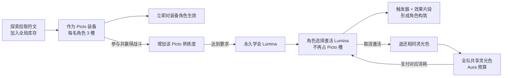

| 名称        | 玩家理解                  | 主要限制                      |
| --------- | --------------------- | ------------------------- |
| Picto     | 当前装备在角色身上的符文          | 每名角色 3 槽；同一枚符文不能同时被多人装备   |
| Lumina    | 某枚符文熟练后永久学会的被动能力      | 需先学会；同一角色不能与同名 Picto 同时启用 |
| 灵光色（Aura） | 激活 Lumina 所需的全队共享点数预算 | 激活时占用，取消时退还；激活记录按角色保存     |

### 11.6 符文触发器

当前可配置的触发时机：

- 常驻被动。
- 战斗开始。
- 回合开始、回合结束。
- 伤害前、伤害后。
- 命中、暴击、击杀。
- 闪避、格挡、完美格挡。
- 死亡。
- 施加状态。

### 11.7 符文效果类型

当前系统支持：

- 修改属性。
- 增加资源、护盾或生命。
- 应用状态/战斗效果。
- 授予临时技能。
- 修改伤害、暴击率和能量获取。
- 追加立即回合。
- 复活。
- 执行独立表现。
- 为特殊机制运行专属能力。

每个效果片段还可限制来源标签、目标标签、是否仅暴击、是否仅击杀，以及每场战斗最大触发次数。

#### 触发—效果组合矩阵

矩阵用于快速发现构筑空间与高风险组合；“高风险”不表示禁止，而表示需要次数上限、来源标签或目标标签约束。

| 触发阶段 | 典型触发器         | 适合的效果方向       | 重点验证          |
| ---- | ------------- | ------------- | ------------- |
| 战前   | 常驻、战斗开始       | 初始属性、资源、临时技能  | 多枚符文叠加顺序      |
| 回合边界 | 回合开始、回合结束     | 回复、状态结算、行动值变化 | 额外回合造成的重复触发   |
| 主动进攻 | 伤害前后、命中、暴击、击杀 | 增伤、能量、追击、施加状态 | 多段技能与群体技能次数   |
| 主动防御 | 闪避、格挡、完美格挡    | 护盾、反击、资源返还    | 一次群攻是否重复结算    |
| 生存事件 | 受伤、死亡         | 减伤、复活、濒死效果    | 递归复活与死亡循环     |
| 状态事件 | 施加状态          | 元素联动、扩散、资源奖励  | 状态刷新是否被视为再次施加 |

---

## 12. Boss 战设计

### 12.1 Boss 战目标

Boss 战是移动探索、队伍构筑、元素弱点、行动条、主动防御、QTE 和演出系统的综合应用。Boss 不应仅依赖更高血量，而应通过阶段、部位和目标选择迫使玩家改变策略。

### 12.2 阶段系统

每个阶段可配置：

- 阶段编号与生命阈值。
- 到达阈值时是否锁血，防止高爆发跳过阶段。
- 阶段进入定序器和 Boss 绑定位置。
- 本阶段追加技能池。
- 进入阶段时强制释放的技能。
- 阶段持续拥有的被动标签。

建议阶段切换至少改变两项：技能组合、目标偏好、场地规则、部位状态、弱点或主动防御节奏。

### 12.3 部位破坏

Boss 部位可拥有：

- 独立名称、目标标记、生命和破坏值。
- 独立元素弱点。
- 破坏后禁用的技能 ID 或技能标签。
- 破坏后给 Boss 添加的状态标签。
- 是否暴露核心。

部位破坏应提供可见的模型、材质、特效或动作变化。若玩家只看到 UI 数值下降而 Boss 外观不变，部位系统会缺少满足感。

#### Boss 系统联动图

Boss 的难度应来自多个可读系统相互作用，而不是只放大生命和伤害。

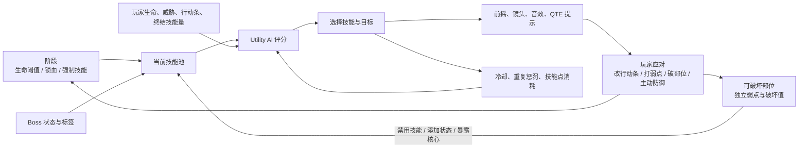

### 12.4 Boss  AI

Boss 不只是按固定权重随机技能，而会综合评估：

- 是否能击杀低生命目标。
- 目标威胁值。
- 目标距离下次行动的紧迫程度。
- 目标终结技是否即将可用。
- 技能能否命中弱点。
- 嘲讽状态。
- 是否刚刚连续攻击过同一目标。
- 是否会造成严重过量伤害。
- 技能冷却是否可用。
- Boss 当前生命区间、阶段、被破坏部位和运行时标签。

### 12.5 Boss 技能

每个技能可配置：

- 普通能力或定序器技能两种执行方式。
- 目标类型、SP 消耗、基础权重和行动延迟。
- 冷却回合、重复使用惩罚。
- 生效生命区间和低生命权重加成。
- 预计伤害、元素、斩杀、减益和惩罚终结技倾向。
- 被哪些破坏部位禁用。
- 需要或禁止哪些 Boss 状态。

### 12.6 Boss 设计模板

每个 Boss 的设计至少应回答：

1. 这个 Boss 要考验玩家哪两个核心系统？
2. 玩家第一次失败后能够学到什么？
3. 哪些攻击适合格挡、闪避或 QTE？提示如何区分？
4. 哪个部位值得优先破坏，破坏后具体改变什么？
5. 每个阶段为什么需要改变打法？
6. 元素弱点是固定、轮换还是由部位决定？
7. Boss 如何防止被持续控制、无限额外回合或百分比持续伤害压制？
8. 胜利奖励如何支持后续构筑？

### 12.7 Boss 垂直切片节奏模板

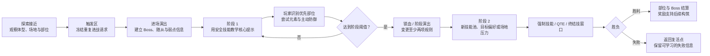

| 节奏节点 | 对玩家展示什么       | 对策划验证什么             |
| ---- | ------------- | ------------------- |
| 进场   | 体型、部位、随从、基本弱点 | 玩家是否知道第一步该观察什么      |
| 阶段 1 | 可学习的攻击提示与安全试错 | 格挡、闪避、QTE 的提示是否可区分  |
| 转阶段  | 规则变化与原因       | 是否至少改变两项决策条件，而非单纯增伤 |
| 阶段 2 | 技能组合升级与资源压力   | 前一阶段学到的知识是否仍有价值     |
| 结算   | 部位成果、奖励、世界反馈  | 奖励是否回到符文与下一轮探索循环    |
